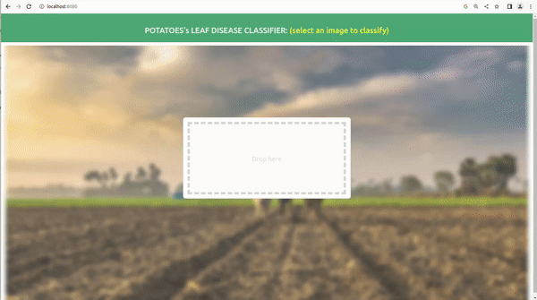
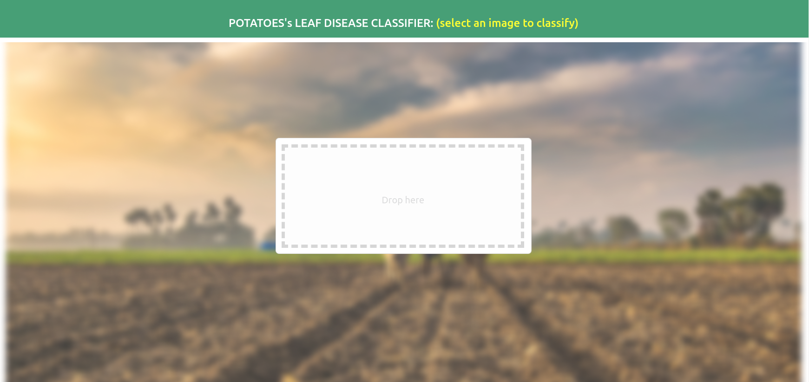

# Potatoes leaf Disease classifier

## Description

In this project, we trained an ML Model to classify potatoes leaf disease. Basically, we provide an image to our model that will tell us if the leaf is infected or not. Three classes are are available : `Early Blight, Late Blight` and `Healthy`. For this purpose, we used the [Plant Village dataset from kaggle](https://www.kaggle.com/datasets/arjuntejaswi/plant-village/discussion/425047?resource=download). The daset contains images of different fruit but we only use `potato images`.

To test our model and make it easier for use, we make a web page using `Fast Api` and `vueJs` were user can drag in drop an image to classify. 


## Final Ouput Sample:

- In Action

    

## Requirements

    - python3
    - tensorflow 2.10
    - tf-serving
    - tf-dataset
    - Docker, 


## Project setups

### For Python

1. Intall Python3
2. Setup a virtual environment
3. Install dependances from `api` folder : 
    ```
    pip3 install -r api/requirements.txt
    ```
4. Install docker ([Instruction here](https://docs.docker.com/engine/install/ubuntu/)) 

4. Install [tf-serving](https://www.tensorflow.org/tfx/serving/docker?hl=fr) using `docker`:
    ```
    docker pull tensorflow/serving
    ```

### For Model Training

1. Download dataset from [kaggle](https://www.kaggle.com/datasets/arjuntejaswi/plant-village/discussion/425047?resource=download)
2. Only keep folders related to Potatoes.
3. Install `Jupyter Notebook`.
4. Run Jupyter Notebook from command line and access it in Browser using the snipet bellow:
```
jupyter notebook
```
5. Open `model_training/model.ipynb` in Jupyter Notebook.
6. In cell `#....`, update the path to dataset.
7. Run all the Cells one by one.

### Frontend

1. Install **NPM**
2. Install [Vue CLI](https://cli.vuejs.org/guide/installation.html)
3. Move to `frontend` directory from a command line and install VueJs depencies for the web page :

    ```
    npm install
    ```

## Running the APP

### API using FastAPI & TF Serve
1. Get inside `api` folder from terminal
2. Copy the `models.config.example` as `models.config` and update the paths in file.
3. Run the TF Serve (Update project directory and confid file paths below)
```
docker run -t --rm -p 8501:8501 -v /home/Documents/code/potato-disease-classification:/potato-disease-classification tensorflow/serving --rest_api_port=8501 --model_config_file=/potato-disease-classification/models.config
```
2. Run :
    ```
        python3 main-tf-serving.py
    ```
3. The API is now running and available at `localhost:9000`

### Frontend
1. Get inside `frontend` folder from terminal using a different terminal window (Don't stop the previous running command)
2. Run :

    ``` 
    npm run serve 
    ```
3. Open your browser and go to: **localhost:8080**
4. The page looks like the following :
    
    

5. Click to select or drag and drop a potato image to test. Enjoy !

